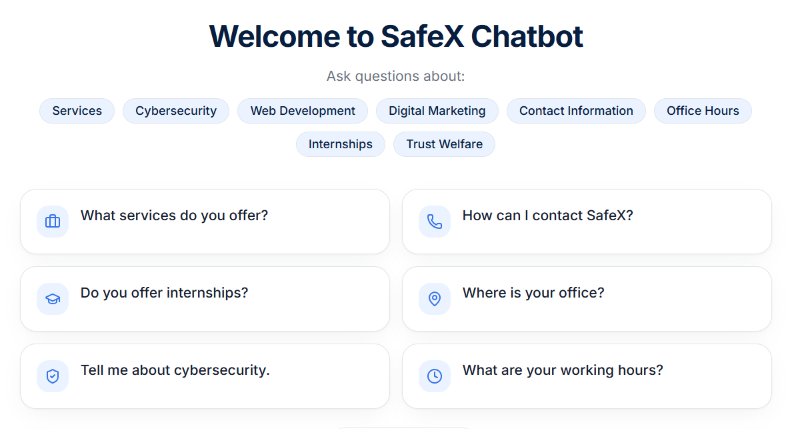
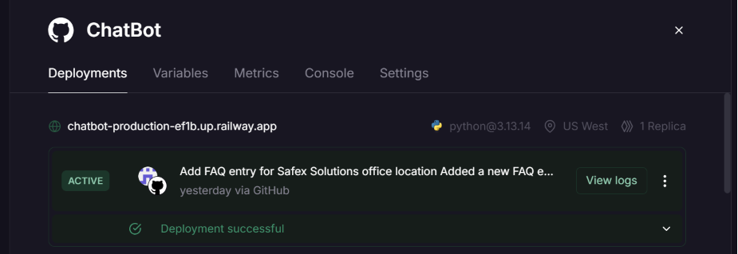
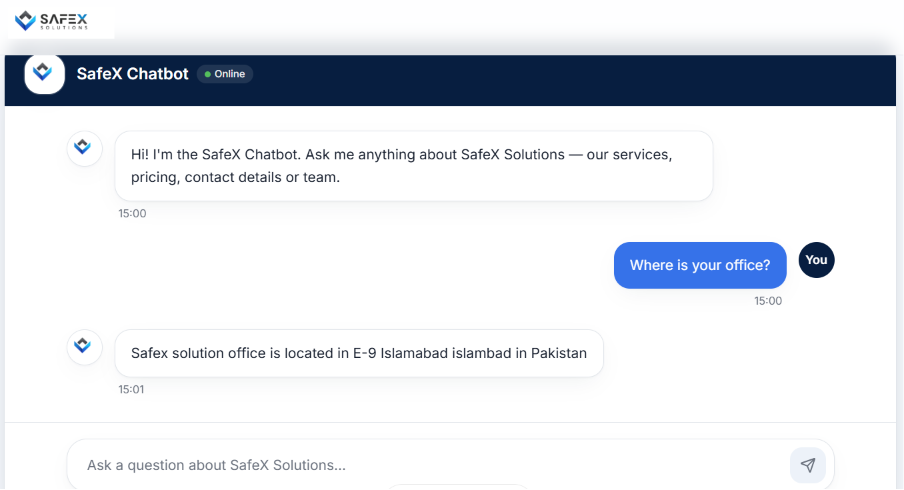

# SafeX FAQ Chatbot :


An AI-powered FAQ chatbot developed for **SafeX Solutions** using **Sentence Transformers**, **Flask**, and **Semantic Search**. The chatbot understands the meaning of user queries and retrieves the most relevant answers from the FAQ database.

Unlike traditional keyword-based chatbots, this system can understand paraphrased questions and return accurate responses.

---

##  Features

- AI-powered semantic FAQ search
- Sentence Transformer embeddings
- Cosine Similarity matching
- Handles paraphrased questions
- Confidence score for each response
- WhatsApp fallback for unmatched queries
- REST API built with Flask
- Railway deployment
- Lovable frontend integration

---

##  🚀 Live Demo

Try the chatbot live here: **[SafeX FAQ Chatbot](https://safex-chatbot.lovable.app)**

---

##  Technologies Used

- Python
- Flask
- Flask-CORS
- Sentence Transformers
- all-MiniLM-L6-v2
- Scikit-learn
- Pandas
- NumPy
- Git & GitHub
- Railway
- Lovable

---

##  Project Structure

```
SafeX-FAQ-Chatbot/
│
├── app.py                 # Flask API
├── Chatbot.py             # Chatbot logic
├── evaluation.py          # Evaluation script
├── FAQ_(1).csv            # FAQ dataset
├── requirements.txt       # Python dependencies
└── README.md
```

---

##  How It Works

1. Load the FAQ dataset.
2. Clean and preprocess the text.
3. Generate sentence embeddings using **all-MiniLM-L6-v2**.
4. Convert the user's question into an embedding.
5. Compare it with all stored FAQ embeddings using Cosine Similarity.
6. Return the most relevant answer if the similarity score is above the threshold.
7. Otherwise, display a fallback message with the SafeX WhatsApp contact.

---

##  Model Information

| Item | Value |
|------|-------|
| Embedding Model | all-MiniLM-L6-v2 |
| Similarity Metric | Cosine Similarity |
| Threshold | 0.40 |
| Framework | Sentence Transformers |

---

##  Evaluation

The chatbot was evaluated using a custom evaluation script.

The evaluation process includes:

- Automatic paraphrasing of questions
- Semantic similarity testing
- Accuracy calculation
- Confidence score analysis
- Mistake logging for future improvements

The chatbot achieved high semantic matching accuracy even when tested with naturally paraphrased questions.

---

##  Deployment

### Backend

- Flask
- Railway

### Frontend

- Lovable

---

##  API Endpoint

### POST `/chat`

### Request

```json
{
    "message": "What services do you offer?"
}
```

### Response

```json
{
    "answer": "SafeX provides cybersecurity, software development, AI solutions, and cloud services.",
    "matched_question": "what services do you offer",
    "confidence": 97.42
}
```

---


### Chatbot Interface



---

### Railway Deployment



---

### Chat Response



---

##  Future Improvements

- FAISS vector database
- Faster semantic retrieval
- Multi-language support
- Voice chatbot
- Conversation memory
- Admin dashboard
- LLM/RAG integration

---

##  Author

**Saman Tariq**


